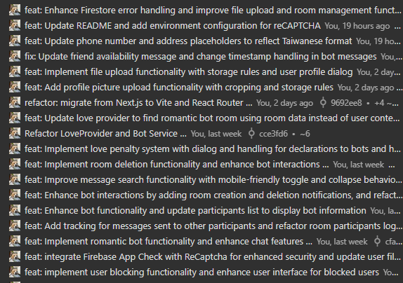
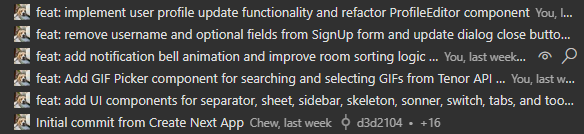

# Firebase Chat

A modern, feature-rich chat application built with React, Firebase, and Vite. Connect with friends, create chat rooms, and experience a unique chat environment with AI companions.

[Link to the demo](https://fir-chat-e7e3e.web.app/)

## Features

- **User Authentication**: Sign up/login with email or Google
- **Private Group Chatrooms**: Create and manage private group conversations
- **Real-time Messaging**: Instant message delivery and updates
- **Message History**: Access complete conversation history
- **Responsive Design**: Optimal experience on all device sizes
- **AI Chat Companions**: Interact with various AI personalities
- **Rich Media Support**: Send images, videos, and GIFs
- **Chrome Notifications**: Get notified of new messages
- **User Management**: Block users, manage profile, and more
- **Message Search**: Find specific messages in conversations
- **Special Features**: Discover hidden interactions and special AI companions!

## Getting Started

### Prerequisites

- Node.js (v16 or higher)
- npm or bun
- Firebase account

### Installation

1. Clone the repository:

   ```bash
   git clone <your-repository-url>
   cd firebase-chat
   ```

2. Install dependencies:

   ```bash
   # Using npm
   npm install

   # OR using bun
   bun install
   ```

3. Create a Firebase project:

   - Go to [Firebase Console](https://console.firebase.google.com/)
   - Create a new project
   - Add a web app to your project
   - Copy the Firebase configuration

4. Start the development server:

   ```bash
   # Using npm
   npm run dev

   # OR using bun
   bun run dev
   ```

5. Open your browser and navigate to `http://localhost:5173`

### Building for Production

```bash
# Using npm
npm run build

# OR using bun
bun run build
```

### Deploying to Firebase Hosting

1. Install Firebase CLI:

   ```bash
   npm install -g firebase-tools
   ```

2. Login to Firebase:

   ```bash
   firebase login
   ```

3. Initialize Firebase in your project:

   ```bash
   firebase init
   ```

4. Deploy to Firebase:

   ```bash
   firebase deploy
   ```

## Using the Application

1. **Sign Up/Sign In**:

   - Create a new account using email or sign in with Google
   - Complete your profile with username and profile picture

2. **Create a Chat Room**:

   - Click on the "+" button to create a new chat room
   - Enter a name for your chat room
   - Select friends to add to the conversation
   - Click "Create Chat"

3. **Send Messages**:

   - Type your message in the text field
   - Press Enter or click the send button
   - Send images, videos, or GIFs using the attachment buttons

4. **Create an AI Chat Companion**:

   - Click on the "+" button
   - Choose "Create AI Chat Companion"
   - Start chatting with your AI friend!

5. **Search Messages**:

   - Use the search icon in a chat room to find specific messages
   - Type keywords to search the conversation

6. **Manage Profile**:

   - Click on the button next to your profile picture to update your information
   - Change your username, profile picture, or other settings

## Feature Checklist

### Basic Components

| Feature              | Status | Description                                                               |
| -------------------- | ------ | ------------------------------------------------------------------------- |
| Membership Mechanism | ✅     | Email Sign Up and Sign In implemented                                     |
| Firebase Hosting     | ✅     | Application hosted on Firebase with proper functioning                    |
| Database read/write  | ✅     | Firebase Firestore used for authenticated data operations                 |
| RWD                  | ✅     | Responsive design works on all device sizes with no disappearing elements |
| Git                  | ✅     | Version control used with regular commits throughout development          |
| Chatroom             | ✅     | Private group chatrooms with message history and member management        |

### Advanced Components

| Feature              | Status | Description                                           |
| -------------------- | ------ | ----------------------------------------------------- |
| Using React          | ✅     | Application built with React and TypeScript           |
| Third-party Sign In  | ✅     | Google authentication implemented                     |
| Chrome Notifications | ✅     | Browser notifications for new messages                |
| CSS Animation        | ✅     | View`animate-ring` css class                          |
| Code Handling        | ✅     | Properly escapes and displays code in messages        |
| User Profile         | ✅     | Customizable user profiles                            |
| Profile Pictures     | ✅     | User profile picture support                          |
| Send Images          | ✅     | Image sharing in conversations                        |
| Send Videos          | ✅     | Video sharing in conversations                        |
| Chatbot              | ✅     | Multiple AI chat companions with unique personalities |
| Block User           | ✅     | Ability to block users from conversations             |
| Unsend Messages      | ✅     | Option to delete sent messages                        |
| Message Search       | ✅     | Search functionality for conversation history         |
| Send GIFs            | ✅     | GIF support through Tenor API integration             |

## Special Features

The application includes some hidden gems for users to discover:

- **Special Companion**: A unique AI companion awaits users after completing their profile, offering a distinctly possessive and protective relationship experience
- **Dynamic Personalities**: Various AI companions with different personalities to chat with
- **Smart Interactions**: Some companions may react to your conversations with others in interesting ways

## Git History

Regular commits were made throughout the development process, not just on the last day. You can view the complete git history in the repository.




